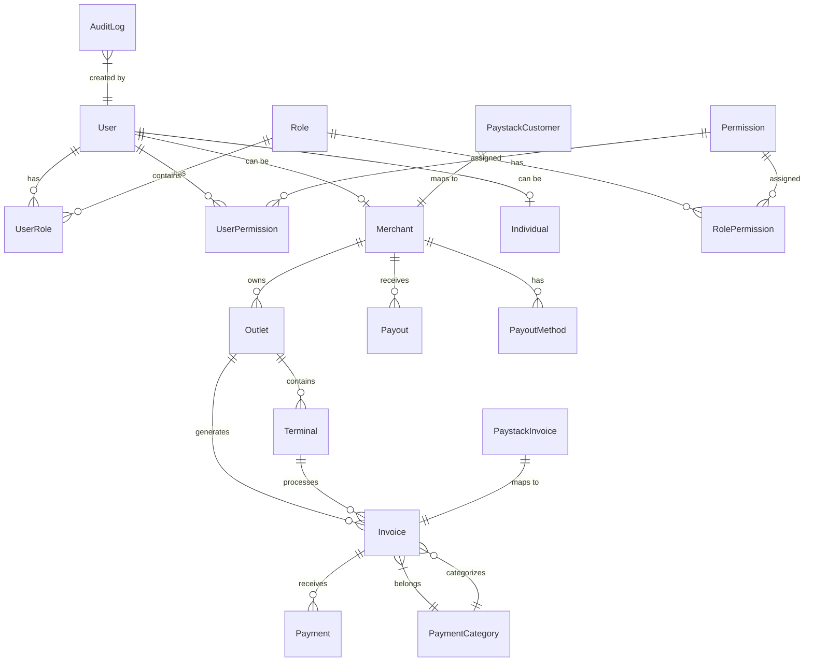

# System Architecture

## Overview

The Mint Platform is built using a modern, scalable architecture that supports multi-tenant operations, real-time processing, and high availability. The system is designed to handle high-volume payment processing while maintaining security, reliability, and performance.

## Architecture Principles

### Design Principles

1. **Microservices Architecture**: Modular services with clear boundaries
2. **Event-Driven Design**: Asynchronous processing using events
3. **API-First Approach**: RESTful APIs with comprehensive documentation
4. **Security by Design**: Security integrated at every layer
5. **Scalability**: Horizontal scaling capabilities
6. **Fault Tolerance**: Graceful degradation and error handling
7. **Observability**: Comprehensive logging, monitoring, and tracing

### Technology Stack

#### Backend

- **Framework**: NestJS (Node.js)
- **Database**: PostgreSQL with Prisma ORM
- **Authentication**: JWT with refresh tokens
- **Caching**: Redis (optional)
- **Message Queue**: Redis/Bull (for background jobs)
- **File Storage**: Local/S3 compatible storage

#### Frontend

- **Framework**: React with TypeScript
- **State Management**: Redux Toolkit
- **UI Library**: Material UI
- **Charts**: Recharts
- **Build Tool**: Create React App

#### Infrastructure

- **Containerization**: Docker
- **Orchestration**: Docker Compose / Kubernetes
- **Reverse Proxy**: Nginx
- **SSL/TLS**: Let's Encrypt or commercial certificates
- **Monitoring**: Prometheus + Grafana
- **Logging**: Structured logging with Winston

## System Architecture

### High-Level Architecture

### Component Architecture

## Data Architecture

### Database Design

#### Primary Database (PostgreSQL)

#### Cache Layer (Redis)

### Data Flow Architecture

## Security Architecture

### Security Layers

### Authentication and Authorization

## Integration Architecture

### External Service Integration

### Webhook Architecture

## Scalability Architecture

### Horizontal Scaling

### Performance Optimization

## Monitoring and Observability

### Monitoring Architecture

### Health Check Architecture

## Deployment Architecture

### Container Architecture

### CI/CD Pipeline

## Disaster Recovery Architecture

### Backup and Recovery

### High Availability

## Future Architecture Considerations

### Microservices Evolution

### Event-Driven Architecture

---

This architecture documentation provides a comprehensive overview of the Mint Platform's system architecture, covering all aspects from high-level design to implementation details and future considerations.
