# Mint Platform Blueprint

## 🎯 Project Overview

The Mint Platform is a comprehensive payment facilitation system designed to enable businesses to manage POS terminals, process payments, and handle payouts through Paystack integration. It serves as a remittance company that facilitates payments for merchants while providing detailed analytics and payout management.

## 🏗️ System Architecture

### High-Level Architecture

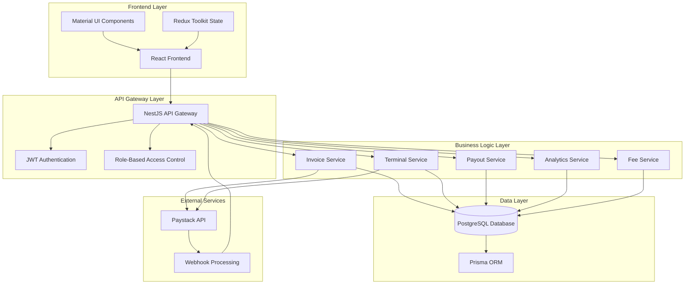

### Component Architecture

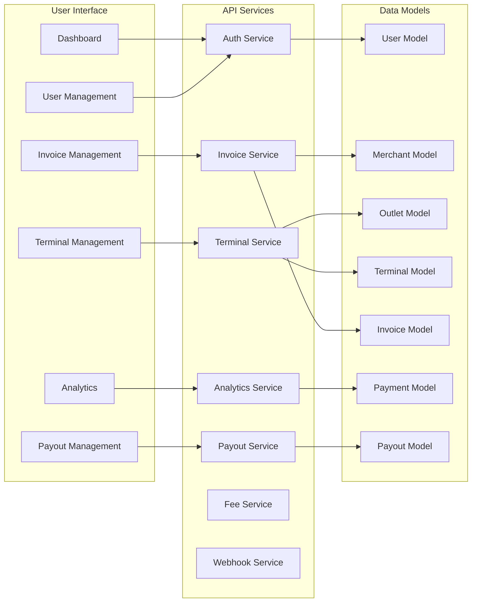

## 🎭 User Roles & Permissions

### Role Hierarchy

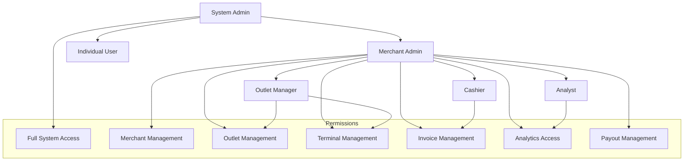

### Permission Matrix

| Role           | User Mgmt | Merchant Mgmt | Outlet Mgmt | Terminal Mgmt | Invoice Mgmt | Analytics | Payout Mgmt |
| -------------- | --------- | ------------- | ----------- | ------------- | ------------ | --------- | ----------- |
| System Admin   | ✅        | ✅            | ✅          | ✅            | ✅           | ✅        | ✅          |
| Merchant Admin | ❌        | ✅            | ✅          | ✅            | ✅           | ✅        | ✅          |
| Outlet Manager | ❌        | ❌            | ✅          | ✅            | ✅           | ❌        | ❌          |
| Cashier        | ❌        | ❌            | ❌          | ❌            | ✅           | ❌        | ❌          |
| Analyst        | ❌        | ❌            | ❌          | ❌            | ❌           | ✅        | ❌          |

## 💳 Payment Flow Architecture

### Invoice Creation Flow

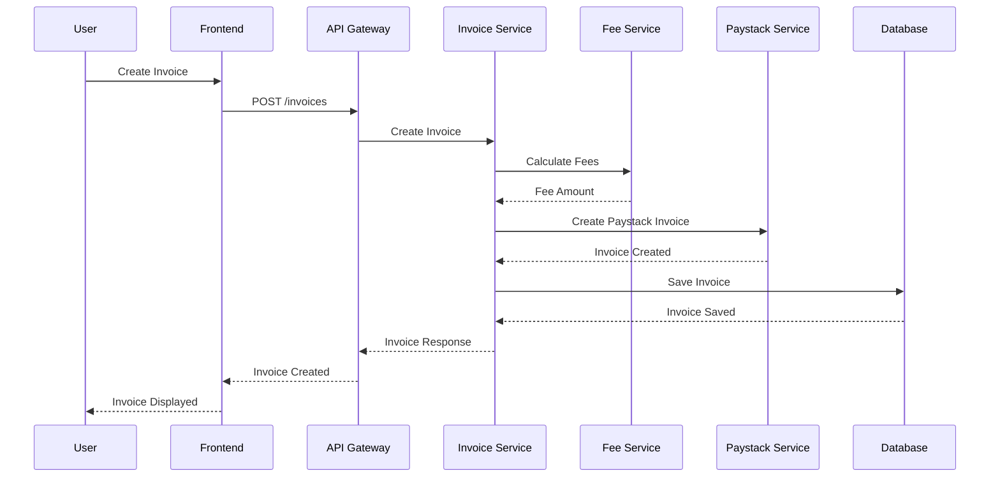

### Payment Processing Flow

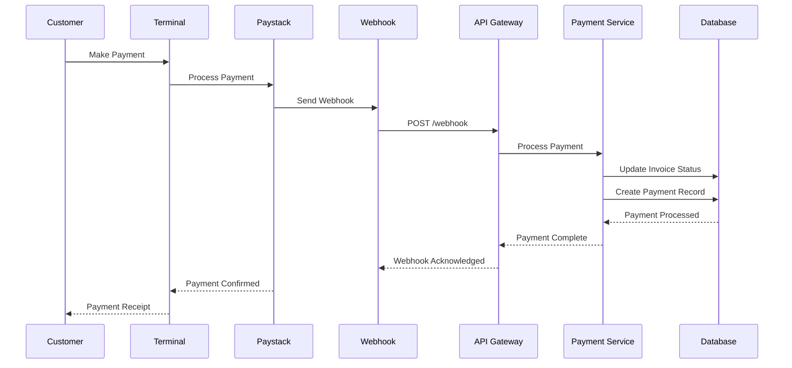

## 🗄️ Database Architecture

### Entity Relationship Diagram

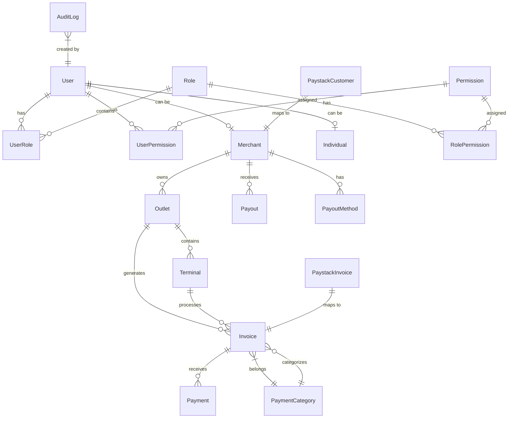

### Core Entities

#### User Management

- **User**: Core user entity with authentication
- **Role**: System roles with permissions
- **Permission**: Granular access control
- **UserRole**: Many-to-many user-role mapping
- **UserPermission**: Direct user permissions
- **RolePermission**: Role-based permissions

#### Business Entities

- **Merchant**: Business entity with multiple outlets
- **Individual**: Personal user accounts
- **Outlet**: Physical business locations
- **Terminal**: POS devices at outlets

#### Payment Entities

- **Invoice**: Payment requests with line items
- **Payment**: Individual payment transactions
- **PaymentCategory**: Invoice categorization
- **PaystackCustomer**: Paystack customer mapping
- **PaystackInvoice**: Paystack invoice mapping

#### Payout Entities

- **PayoutMethod**: Merchant payout preferences
- **Payout**: Scheduled and processed payouts
- **Fee**: Dynamic fee calculations

#### System Entities

- **AuditLog**: Complete activity tracking
- **SystemConfig**: System-wide configuration

## 🔌 API Architecture

### RESTful API Design

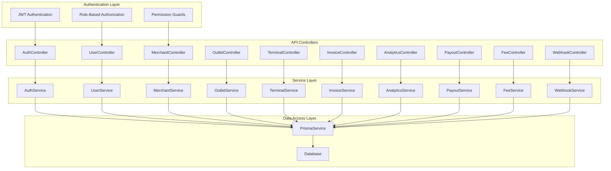

### API Endpoint Structure

```
/api/v1/
├── auth/
│   ├── login
│   ├── register
│   ├── logout
│   ├── refresh
│   └── me
├── users/
│   ├── profile
│   ├── permissions
│   └── roles
├── merchants/
│   ├── profile
│   ├── outlets
│   └── settings
├── outlets/
│   ├── list
│   ├── create
│   ├── update
│   └── delete
├── terminals/
│   ├── list
│   ├── create
│   ├── update
│   ├── status
│   └── assign
├── invoices/
│   ├── list
│   ├── create
│   ├── update
│   ├── cancel
│   └── stats
├── analytics/
│   ├── dashboard
│   ├── revenue-trends
│   ├── top-outlets
│   ├── top-categories
│   ├── payment-methods
│   ├── terminal-performance
│   └── real-time
├── payouts/
│   ├── list
│   ├── create
│   ├── methods
│   └── stats
├── fees/
│   ├── calculate
│   ├── tier
│   └── history
└── webhooks/
    └── paystack
```

## 🔒 Security Architecture

### Security Layers

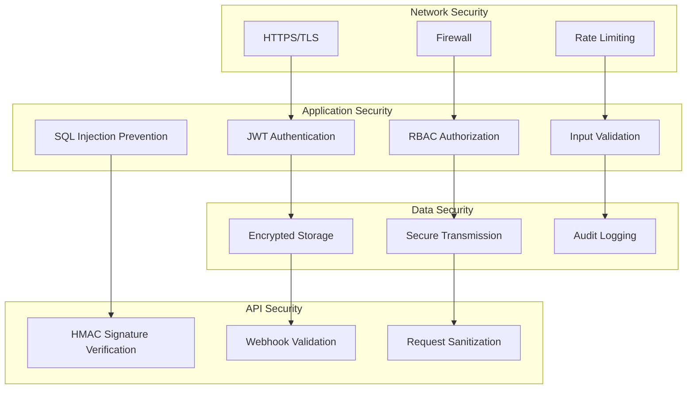

### Authentication Flow

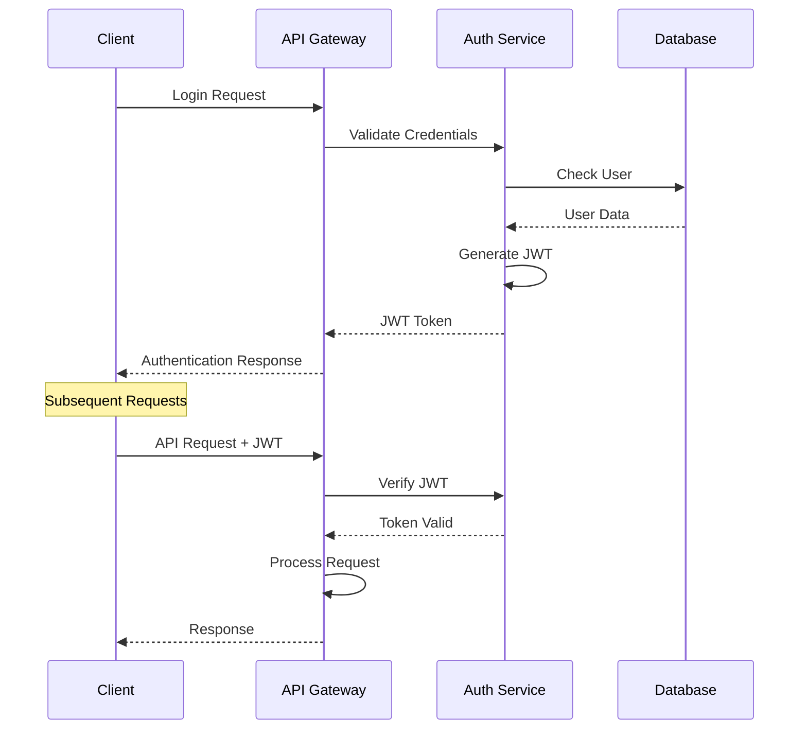

## 📊 Analytics Architecture

### Analytics Data Flow

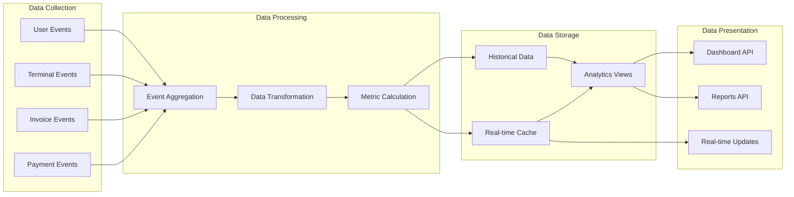

### Analytics Metrics

#### Business Metrics

- **Revenue Metrics**: Total revenue, growth trends, category breakdown
- **Transaction Metrics**: Volume, success rates, average values
- **Customer Metrics**: Retention, acquisition, lifetime value
- **Performance Metrics**: Response times, uptime, error rates

#### Operational Metrics

- **Terminal Performance**: Usage, uptime, transaction volume
- **Outlet Performance**: Revenue, transaction count, efficiency
- **Payment Methods**: Usage distribution, success rates
- **Geographic Metrics**: Location-based performance

## 🚀 Deployment Architecture

### Production Environment

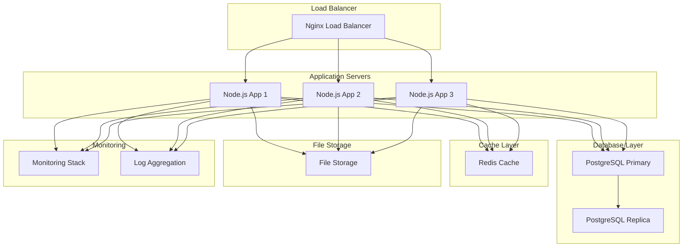

### Development Environment

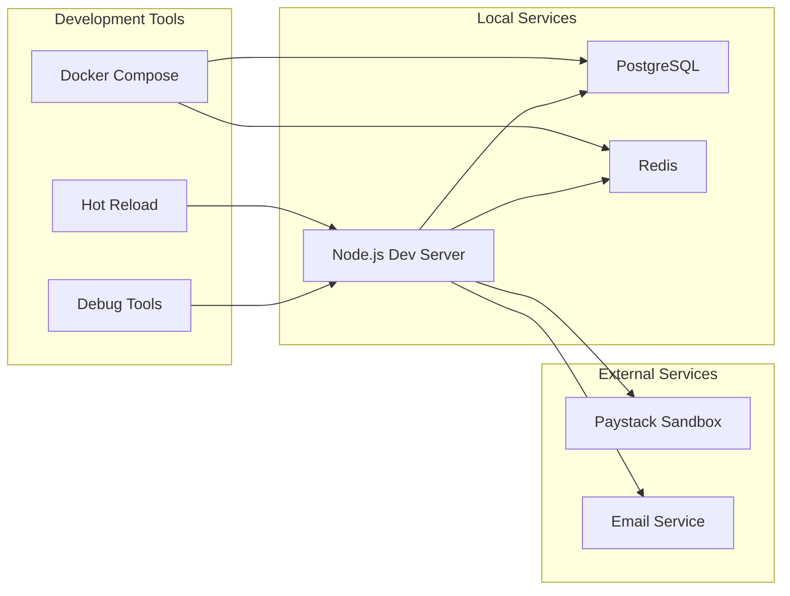

## 🔄 Integration Architecture

### Paystack Integration

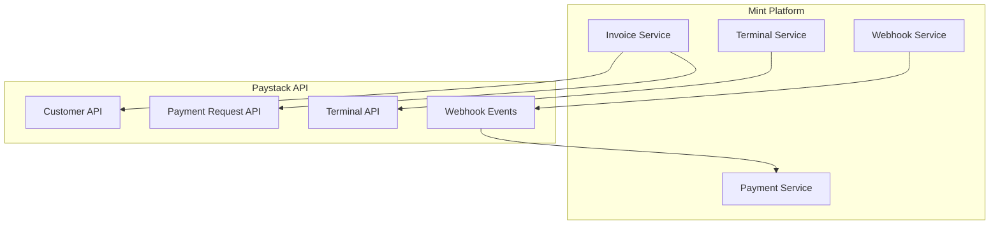

### Third-party Integrations

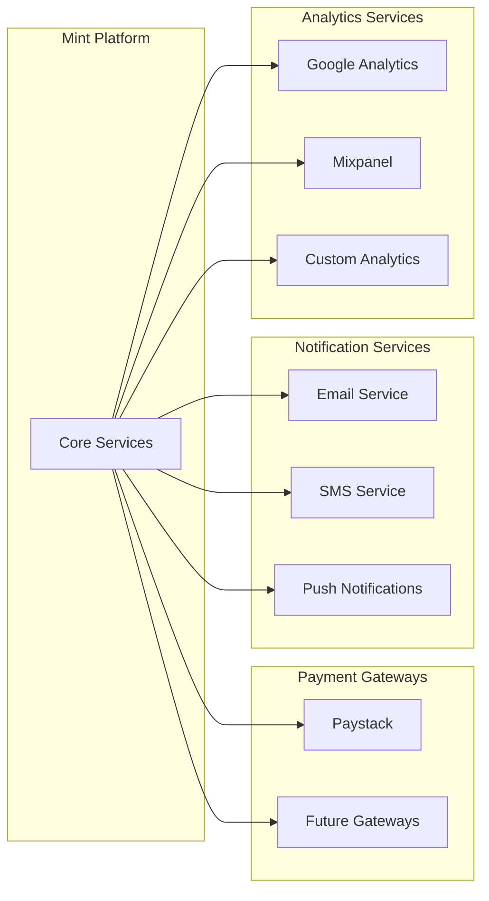

## 📈 Scalability Considerations

### Horizontal Scaling

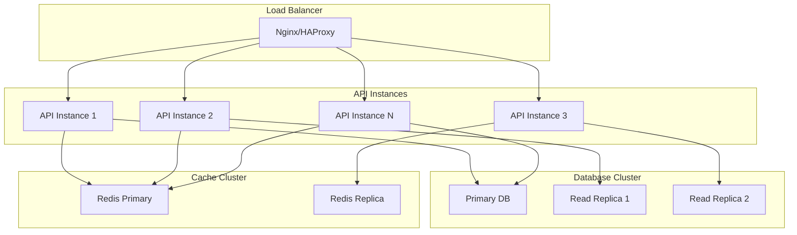

### Performance Optimization

- **Database Indexing**: Optimized queries and indexes
- **Caching Strategy**: Redis for frequently accessed data
- **Connection Pooling**: Efficient database connections
- **API Rate Limiting**: Prevent abuse and ensure fair usage
- **CDN Integration**: Static asset delivery optimization
- **Database Partitioning**: Large table optimization

## 🔮 Future Enhancements

### Planned Features

1. **Multi-currency Support**: Support for multiple currencies
2. **Advanced Analytics**: Machine learning insights
3. **Mobile Applications**: Native iOS and Android apps
4. **API Versioning**: Backward compatibility management
5. **Microservices Architecture**: Service decomposition
6. **Event Sourcing**: Complete audit trail
7. **Real-time Notifications**: WebSocket integration
8. **Advanced Reporting**: Custom report builder

### Integration Roadmap

1. **Additional Payment Gateways**: Stripe, Flutterwave, etc.
2. **Banking Integrations**: Direct bank API connections
3. **Accounting Software**: QuickBooks, Xero integration
4. **CRM Systems**: Salesforce, HubSpot integration
5. **E-commerce Platforms**: Shopify, WooCommerce integration

---

This blueprint serves as the foundation for the Mint Platform, providing a comprehensive overview of the system architecture, design decisions, and implementation strategies. It should be used as a reference for development, deployment, and maintenance of the platform.
