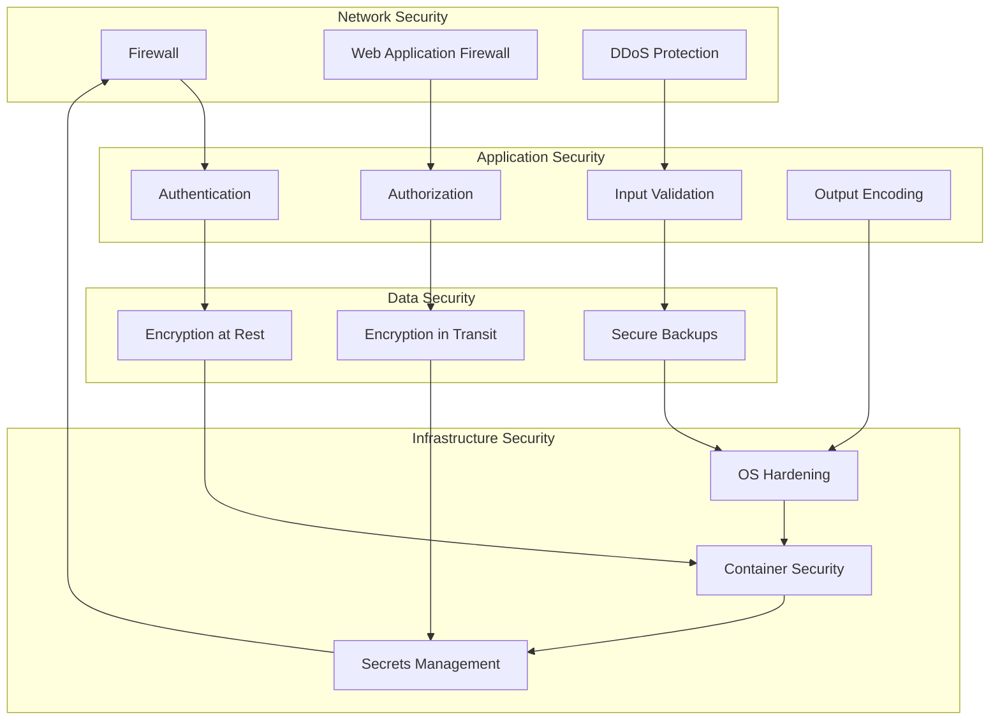

# Security Guide

## Overview

This guide provides comprehensive information about security implementation, best practices, and procedures for the Mint Platform. It covers authentication, authorization, data protection, and security monitoring.

## Security Architecture

### Security Layers



### Security Principles

1. **Defense in Depth**: Multiple layers of security controls
2. **Least Privilege**: Users have minimum required permissions
3. **Zero Trust**: Never trust, always verify
4. **Security by Design**: Security integrated from the beginning
5. **Continuous Monitoring**: Ongoing security monitoring and assessment

## Authentication and Authorization

### Authentication

#### JWT Implementation

```typescript
// auth/jwt.strategy.ts
import { Injectable, UnauthorizedException } from '@nestjs/common';
import { PassportStrategy } from '@nestjs/passport';
import { ExtractJwt, Strategy } from 'passport-jwt';
import { AuthService } from './auth.service';

@Injectable()
export class JwtStrategy extends PassportStrategy(Strategy) {
  constructor(private authService: AuthService) {
    super({
      jwtFromRequest: ExtractJwt.fromAuthHeaderAsBearerToken(),
      ignoreExpiration: false,
      secretOrKey: process.env.JWT_SECRET,
    });
  }

  async validate(payload: any) {
    const user = await this.authService.validateUser(payload.sub);
    if (!user) {
      throw new UnauthorizedException();
    }
    return user;
  }
}
```

#### Password Security

```typescript
// auth/password.service.ts
import { Injectable } from '@nestjs/common';
import * as bcrypt from 'bcrypt';

@Injectable()
export class PasswordService {
  private readonly saltRounds = 12;

  async hashPassword(password: string): Promise<string> {
    return bcrypt.hash(password, this.saltRounds);
  }

  async validatePassword(
    password: string,
    hashedPassword: string
  ): Promise<boolean> {
    return bcrypt.compare(password, hashedPassword);
  }

  validatePasswordStrength(password: string): boolean {
    const minLength = 8;
    const hasUpperCase = /[A-Z]/.test(password);
    const hasLowerCase = /[a-z]/.test(password);
    const hasNumbers = /\d/.test(password);
    const hasSpecialChar = /[!@#$%^&*(),.?":{}|<>]/.test(password);

    return (
      password.length >= minLength &&
      hasUpperCase &&
      hasLowerCase &&
      hasNumbers &&
      hasSpecialChar
    );
  }
}
```

#### Multi-Factor Authentication

```typescript
// auth/mfa.service.ts
import { Injectable } from '@nestjs/common';
import * as speakeasy from 'speakeasy';

@Injectable()
export class MfaService {
  generateSecret(): { secret: string; qrCode: string } {
    const secret = speakeasy.generateSecret({
      name: 'Mint Platform',
      issuer: 'Mint Platform',
    });

    return {
      secret: secret.base32,
      qrCode: secret.otpauth_url,
    };
  }

  verifyToken(secret: string, token: string): boolean {
    return speakeasy.totp.verify({
      secret,
      encoding: 'base32',
      token,
      window: 2,
    });
  }

  generateBackupCodes(): string[] {
    return Array.from({ length: 10 }, () =>
      Math.random().toString(36).substr(2, 8).toUpperCase()
    );
  }
}
```

### Authorization

#### Role-Based Access Control (RBAC)

```typescript
// auth/permissions.guard.ts
import { Injectable, CanActivate, ExecutionContext } from '@nestjs/common';
import { Reflector } from '@nestjs/core';
import { PermissionsService } from './permissions.service';

@Injectable()
export class PermissionsGuard implements CanActivate {
  constructor(
    private reflector: Reflector,
    private permissionsService: PermissionsService
  ) {}

  async canActivate(context: ExecutionContext): Promise<boolean> {
    const requiredPermissions = this.reflector.get<string[]>(
      'permissions',
      context.getHandler()
    );

    if (!requiredPermissions) {
      return true;
    }

    const request = context.switchToHttp().getRequest();
    const user = request.user;

    return this.permissionsService.hasPermissions(user.id, requiredPermissions);
  }
}
```

#### Permission Decorator

```typescript
// auth/decorators/permissions.decorator.ts
import { SetMetadata } from '@nestjs/common';

export const RequirePermissions = (permissions: string[]) =>
  SetMetadata('permissions', permissions);
```

#### Usage Example

```typescript
// users/users.controller.ts
import { Controller, Get, UseGuards } from '@nestjs/common';
import { JwtAuthGuard } from '../auth/guards/jwt-auth.guard';
import { PermissionsGuard } from '../auth/guards/permissions.guard';
import { RequirePermissions } from '../auth/decorators/permissions.decorator';

@Controller('users')
@UseGuards(JwtAuthGuard, PermissionsGuard)
export class UsersController {
  @Get()
  @RequirePermissions(['user:read'])
  async getUsers() {
    // Implementation
  }
}
```

## Input Validation and Sanitization

### DTO Validation

```typescript
// users/dto/create-user.dto.ts
import {
  IsEmail,
  IsString,
  MinLength,
  MaxLength,
  Matches,
} from 'class-validator';

export class CreateUserDto {
  @IsEmail()
  email: string;

  @IsString()
  @MinLength(2)
  @MaxLength(50)
  firstName: string;

  @IsString()
  @MinLength(2)
  @MaxLength(50)
  lastName: string;

  @IsString()
  @MinLength(8)
  @MaxLength(128)
  @Matches(
    /^(?=.*[a-z])(?=.*[A-Z])(?=.*\d)(?=.*[!@#$%^&*(),.?":{}|<>]).{8,}$/,
    {
      message:
        'Password must contain at least one uppercase letter, one lowercase letter, one number, and one special character',
    }
  )
  password: string;
}
```

### Input Sanitization

```typescript
// common/pipes/sanitize.pipe.ts
import { PipeTransform, Injectable, ArgumentMetadata } from '@nestjs/common';
import { transform } from 'class-transformer';
import { validate } from 'class-validator';
import { plainToClass } from 'class-transformer';

@Injectable()
export class SanitizePipe implements PipeTransform<any> {
  async transform(value: any, { metatype }: ArgumentMetadata) {
    if (!metatype || !this.toValidate(metatype)) {
      return value;
    }

    const object = plainToClass(metatype, value);
    const errors = await validate(object);

    if (errors.length > 0) {
      throw new BadRequestException('Validation failed');
    }

    return this.sanitizeObject(object);
  }

  private sanitizeObject(obj: any): any {
    if (typeof obj !== 'object' || obj === null) {
      return obj;
    }

    const sanitized = { ...obj };

    for (const key in sanitized) {
      if (typeof sanitized[key] === 'string') {
        sanitized[key] = this.sanitizeString(sanitized[key]);
      } else if (typeof sanitized[key] === 'object') {
        sanitized[key] = this.sanitizeObject(sanitized[key]);
      }
    }

    return sanitized;
  }

  private sanitizeString(str: string): string {
    return str
      .trim()
      .replace(/<script\b[^<]*(?:(?!<\/script>)<[^<]*)*<\/script>/gi, '')
      .replace(/javascript:/gi, '')
      .replace(/on\w+\s*=/gi, '');
  }

  private toValidate(metatype: Function): boolean {
    const types: Function[] = [String, Boolean, Number, Array, Object];
    return !types.includes(metatype);
  }
}
```

## Data Protection

### Encryption

#### Data Encryption Service

```typescript
// common/services/encryption.service.ts
import { Injectable } from '@nestjs/common';
import * as crypto from 'crypto';

@Injectable()
export class EncryptionService {
  private readonly algorithm = 'aes-256-gcm';
  private readonly key = crypto.scryptSync(
    process.env.ENCRYPTION_KEY,
    'salt',
    32
  );

  encrypt(text: string): { encrypted: string; iv: string; tag: string } {
    const iv = crypto.randomBytes(16);
    const cipher = crypto.createCipher(this.algorithm, this.key);
    cipher.setAAD(Buffer.from('mint-platform', 'utf8'));

    let encrypted = cipher.update(text, 'utf8', 'hex');
    encrypted += cipher.final('hex');

    const tag = cipher.getAuthTag();

    return {
      encrypted,
      iv: iv.toString('hex'),
      tag: tag.toString('hex'),
    };
  }

  decrypt(encryptedData: {
    encrypted: string;
    iv: string;
    tag: string;
  }): string {
    const decipher = crypto.createDecipher(this.algorithm, this.key);
    decipher.setAAD(Buffer.from('mint-platform', 'utf8'));
    decipher.setAuthTag(Buffer.from(encryptedData.tag, 'hex'));

    let decrypted = decipher.update(encryptedData.encrypted, 'hex', 'utf8');
    decrypted += decipher.final('utf8');

    return decrypted;
  }
}
```

#### Database Encryption

```typescript
// prisma/schema.prisma
model User {
  id        String   @id @default(cuid())
  email     String   @unique
  firstName String
  lastName  String
  password  String   // Encrypted
  ssn       String?  // Encrypted
  createdAt DateTime @default(now())
  updatedAt DateTime @updatedAt

  @@map("users")
}
```

### Data Anonymization

```typescript
// common/services/anonymization.service.ts
import { Injectable } from '@nestjs/common';
import * as crypto from 'crypto';

@Injectable()
export class AnonymizationService {
  anonymizeEmail(email: string): string {
    const [localPart, domain] = email.split('@');
    const anonymizedLocal = this.anonymizeString(localPart);
    return `${anonymizedLocal}@${domain}`;
  }

  anonymizePhone(phone: string): string {
    return phone.replace(/\d(?=\d{4})/g, '*');
  }

  anonymizeString(str: string): string {
    if (str.length <= 2) return str;
    return str[0] + '*'.repeat(str.length - 2) + str[str.length - 1];
  }

  generateHash(data: string): string {
    return crypto.createHash('sha256').update(data).digest('hex');
  }
}
```

## API Security

### Rate Limiting

```typescript
// common/guards/rate-limit.guard.ts
import { Injectable, CanActivate, ExecutionContext } from '@nestjs/common';
import { ThrottlerGuard } from '@nestjs/throttler';

@Injectable()
export class RateLimitGuard extends ThrottlerGuard {
  protected getTracker(req: Record<string, any>): string {
    return req.ip;
  }

  protected generateKey(context: ExecutionContext, tracker: string): string {
    const { url } = context.switchToHttp().getRequest();
    return `${tracker}:${url}`;
  }
}
```

### CORS Configuration

```typescript
// main.ts
import { NestFactory } from '@nestjs/core';
import { AppModule } from './app.module';

async function bootstrap() {
  const app = await NestFactory.create(AppModule);

  app.enableCors({
    origin: process.env.CORS_ORIGIN?.split(',') || ['http://localhost:3001'],
    credentials: true,
    methods: ['GET', 'HEAD', 'PUT', 'PATCH', 'POST', 'DELETE', 'OPTIONS'],
    allowedHeaders: ['Content-Type', 'Authorization', 'x-paystack-signature'],
    exposedHeaders: [
      'X-RateLimit-Limit',
      'X-RateLimit-Remaining',
      'X-RateLimit-Reset',
    ],
  });

  await app.listen(3000);
}
bootstrap();
```

### Security Headers

```typescript
// common/middleware/security.middleware.ts
import { Injectable, NestMiddleware } from '@nestjs/common';
import { Request, Response, NextFunction } from 'express';

@Injectable()
export class SecurityMiddleware implements NestMiddleware {
  use(req: Request, res: Response, next: NextFunction) {
    res.setHeader('X-Frame-Options', 'DENY');
    res.setHeader('X-Content-Type-Options', 'nosniff');
    res.setHeader('X-XSS-Protection', '1; mode=block');
    res.setHeader('Referrer-Policy', 'strict-origin-when-cross-origin');
    res.setHeader('Content-Security-Policy', "default-src 'self'");
    res.setHeader(
      'Strict-Transport-Security',
      'max-age=31536000; includeSubDomains'
    );

    next();
  }
}
```

## Webhook Security

### Signature Verification

```typescript
// webhooks/webhook.service.ts
import { Injectable, UnauthorizedException } from '@nestjs/common';
import * as crypto from 'crypto';

@Injectable()
export class WebhookService {
  verifySignature(payload: string, signature: string, secret: string): boolean {
    const expectedSignature = crypto
      .createHmac('sha256', secret)
      .update(payload)
      .digest('hex');

    const receivedSignature = signature.replace('sha256=', '');

    return crypto.timingSafeEqual(
      Buffer.from(expectedSignature, 'hex'),
      Buffer.from(receivedSignature, 'hex')
    );
  }

  async handleWebhook(payload: any, signature: string): Promise<void> {
    const isValid = this.verifySignature(
      JSON.stringify(payload),
      signature,
      process.env.WEBHOOK_SECRET
    );

    if (!isValid) {
      throw new UnauthorizedException('Invalid webhook signature');
    }

    // Process webhook
    await this.processWebhook(payload);
  }
}
```

## Security Monitoring

### Audit Logging

```typescript
// common/interceptors/audit.interceptor.ts
import {
  Injectable,
  NestInterceptor,
  ExecutionContext,
  CallHandler,
} from '@nestjs/common';
import { Observable } from 'rxjs';
import { tap } from 'rxjs/operators';
import { AuditService } from '../services/audit.service';

@Injectable()
export class AuditInterceptor implements NestInterceptor {
  constructor(private auditService: AuditService) {}

  intercept(context: ExecutionContext, next: CallHandler): Observable<any> {
    const request = context.switchToHttp().getRequest();
    const response = context.switchToHttp().getResponse();
    const user = request.user;

    const startTime = Date.now();

    return next.handle().pipe(
      tap(() => {
        const duration = Date.now() - startTime;

        this.auditService.log({
          userId: user?.id,
          action: request.method,
          resource: request.url,
          ipAddress: request.ip,
          userAgent: request.get('User-Agent'),
          statusCode: response.statusCode,
          duration,
          timestamp: new Date(),
        });
      })
    );
  }
}
```

### Security Event Monitoring

```typescript
// common/services/security-monitor.service.ts
import { Injectable, Logger } from '@nestjs/common';
import { EventEmitter2 } from '@nestjs/event-emitter';

@Injectable()
export class SecurityMonitorService {
  private readonly logger = new Logger(SecurityMonitorService.name);

  constructor(private eventEmitter: EventEmitter2) {}

  logSecurityEvent(event: SecurityEvent): void {
    this.logger.warn(`Security event: ${event.type}`, event);

    // Emit event for real-time monitoring
    this.eventEmitter.emit('security.event', event);

    // Send alert if critical
    if (event.severity === 'critical') {
      this.sendSecurityAlert(event);
    }
  }

  private sendSecurityAlert(event: SecurityEvent): void {
    // Send to security team
    this.logger.error(`CRITICAL SECURITY EVENT: ${event.type}`, event);
  }
}

interface SecurityEvent {
  type: string;
  severity: 'low' | 'medium' | 'high' | 'critical';
  userId?: string;
  ipAddress: string;
  userAgent: string;
  details: any;
  timestamp: Date;
}
```

## Compliance and Standards

### GDPR Compliance

```typescript
// common/services/gdpr.service.ts
import { Injectable } from '@nestjs/common';
import { PrismaService } from '../prisma/prisma.service';

@Injectable()
export class GdprService {
  constructor(private prisma: PrismaService) {}

  async exportUserData(userId: string): Promise<any> {
    const user = await this.prisma.user.findUnique({
      where: { id: userId },
      include: {
        merchant: true,
        individual: true,
        auditLogs: true,
      },
    });

    return {
      personalData: {
        email: user.email,
        firstName: user.firstName,
        lastName: user.lastName,
        createdAt: user.createdAt,
      },
      activityData: user.auditLogs,
      businessData: user.merchant || user.individual,
    };
  }

  async deleteUserData(userId: string): Promise<void> {
    await this.prisma.$transaction(async (tx) => {
      // Anonymize instead of delete for audit purposes
      await tx.user.update({
        where: { id: userId },
        data: {
          email: `deleted_${userId}@example.com`,
          firstName: 'Deleted',
          lastName: 'User',
          status: 'DELETED',
        },
      });
    });
  }
}
```

### PCI DSS Compliance

```typescript
// common/services/pci.service.ts
import { Injectable } from '@nestjs/common';

@Injectable()
export class PciService {
  validateCardNumber(cardNumber: string): boolean {
    // Luhn algorithm validation
    const digits = cardNumber.replace(/\D/g, '');
    let sum = 0;
    let isEven = false;

    for (let i = digits.length - 1; i >= 0; i--) {
      let digit = parseInt(digits[i]);

      if (isEven) {
        digit *= 2;
        if (digit > 9) {
          digit -= 9;
        }
      }

      sum += digit;
      isEven = !isEven;
    }

    return sum % 10 === 0;
  }

  maskCardNumber(cardNumber: string): string {
    const digits = cardNumber.replace(/\D/g, '');
    if (digits.length < 4) return cardNumber;

    return '*'.repeat(digits.length - 4) + digits.slice(-4);
  }
}
```

## Security Testing

### Security Test Suite

```typescript
// test/security/security.test.ts
import { Test, TestingModule } from '@nestjs/testing';
import { INestApplication } from '@nestjs/common';
import * as request from 'supertest';
import { AppModule } from '../../src/app.module';

describe('Security Tests', () => {
  let app: INestApplication;

  beforeEach(async () => {
    const moduleFixture: TestingModule = await Test.createTestingModule({
      imports: [AppModule],
    }).compile();

    app = moduleFixture.createNestApplication();
    await app.init();
  });

  afterEach(async () => {
    await app.close();
  });

  it('should reject requests without authentication', () => {
    return request(app.getHttpServer()).get('/users').expect(401);
  });

  it('should reject requests with invalid JWT', () => {
    return request(app.getHttpServer())
      .get('/users')
      .set('Authorization', 'Bearer invalid-token')
      .expect(401);
  });

  it('should reject requests with SQL injection attempts', () => {
    return request(app.getHttpServer())
      .get('/users')
      .query({ email: "'; DROP TABLE users; --" })
      .expect(400);
  });

  it('should reject requests with XSS attempts', () => {
    return request(app.getHttpServer())
      .post('/users')
      .send({
        email: 'test@example.com',
        firstName: '<script>alert("xss")</script>',
        lastName: 'Doe',
        password: 'password123',
      })
      .expect(400);
  });
});
```

## Incident Response

### Security Incident Response Plan

```typescript
// common/services/incident-response.service.ts
import { Injectable, Logger } from '@nestjs/common';
import { EventEmitter2 } from '@nestjs/event-emitter';

@Injectable()
export class IncidentResponseService {
  private readonly logger = new Logger(IncidentResponseService.name);

  constructor(private eventEmitter: EventEmitter2) {}

  async handleSecurityIncident(incident: SecurityIncident): Promise<void> {
    this.logger.error(`Security incident detected: ${incident.type}`, incident);

    // Immediate response
    await this.immediateResponse(incident);

    // Escalate if necessary
    if (incident.severity === 'critical') {
      await this.escalateIncident(incident);
    }

    // Document incident
    await this.documentIncident(incident);
  }

  private async immediateResponse(incident: SecurityIncident): Promise<void> {
    switch (incident.type) {
      case 'brute_force_attack':
        await this.blockIpAddress(incident.ipAddress);
        break;
      case 'suspicious_activity':
        await this.flagUser(incident.userId);
        break;
      case 'data_breach':
        await this.notifyAffectedUsers(incident.affectedUsers);
        break;
    }
  }

  private async escalateIncident(incident: SecurityIncident): Promise<void> {
    // Notify security team
    this.eventEmitter.emit('security.incident.critical', incident);
  }

  private async documentIncident(incident: SecurityIncident): Promise<void> {
    // Log to security database
    await this.logSecurityIncident(incident);
  }
}

interface SecurityIncident {
  type: string;
  severity: 'low' | 'medium' | 'high' | 'critical';
  userId?: string;
  ipAddress: string;
  description: string;
  affectedUsers?: string[];
  timestamp: Date;
}
```

## Security Checklist

### Development Security Checklist

- [ ] Input validation implemented
- [ ] Output encoding applied
- [ ] Authentication required for protected endpoints
- [ ] Authorization checks implemented
- [ ] SQL injection prevention
- [ ] XSS prevention
- [ ] CSRF protection
- [ ] Rate limiting implemented
- [ ] Security headers configured
- [ ] Error handling doesn't leak sensitive information
- [ ] Logging doesn't include sensitive data
- [ ] Dependencies are up to date
- [ ] Security tests written

### Deployment Security Checklist

- [ ] HTTPS enabled
- [ ] Firewall configured
- [ ] Database access restricted
- [ ] Secrets management implemented
- [ ] Monitoring and alerting configured
- [ ] Backup and recovery tested
- [ ] Incident response plan in place
- [ ] Security documentation updated
- [ ] Penetration testing completed
- [ ] Compliance requirements met

---

This security guide provides comprehensive information about security implementation and best practices for the Mint Platform. Follow these guidelines to ensure the platform maintains the highest security standards and protects user data effectively.
